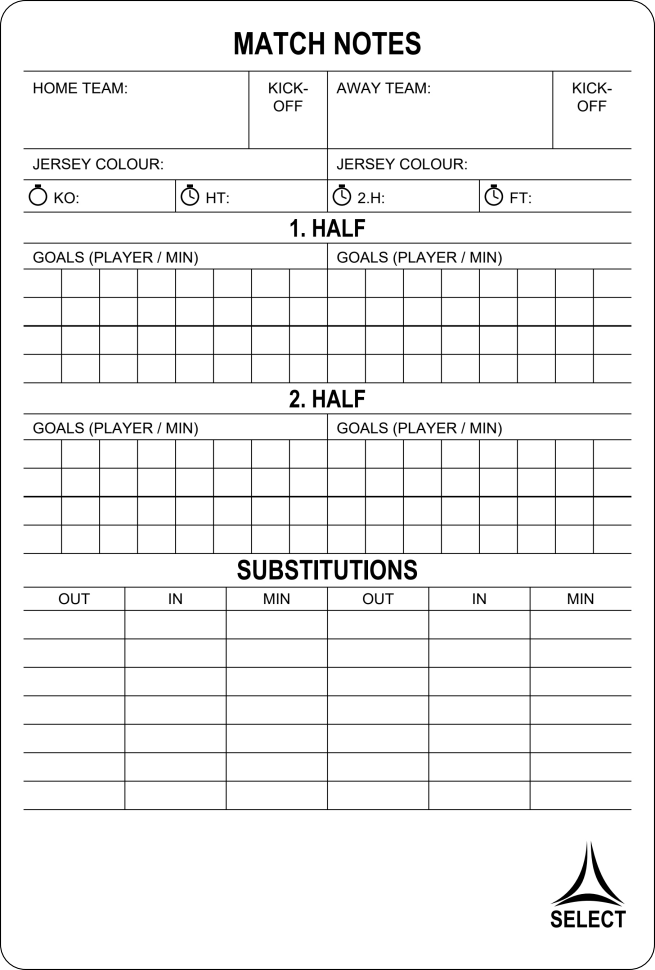
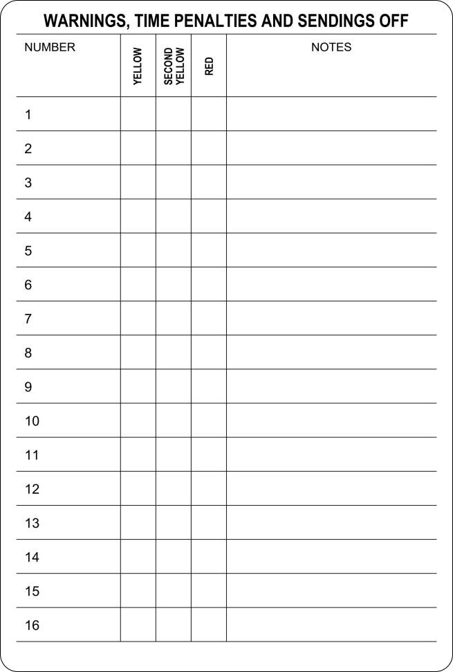

# Printable referee cards

Football referee cards sized **77 x 114 mm**, with rounded cutting borders and layouts designed for black-and-white printing.

**[Download the A4 print PDF](https://github.com/KaliCZ/referee-cards/raw/refs/heads/main/print/referee-cards-A4-duplex.pdf)**

No software setup is needed to print. The PDFs are already included in the repository.

## Print and cut

1. Open [`print/referee-cards-A4-duplex.pdf`](print/referee-cards-A4-duplex.pdf).
2. Select **A4, portrait, Actual size / 100%**, with one PDF page per paper side.
3. Enable **duplex printing, flip on long edge**. Disable Fit, Shrink, booklet mode and borderless enlargement.
4. Print one test sheet. The scale bar should measure **50 mm**, and each card's outer border should measure **77 x 114 mm**.
5. Cut along the outside of the rounded black border. One duplex A4 sheet makes **four cards**.

If front/back registration is offset, adjust the printer's duplex alignment. The PDF positions are symmetric.

[`print/referee-card-front-back.pdf`](print/referee-card-front-back.pdf) contains two individual card-sized pages for a print shop or other layouts.

## Clone and print

```sh
git clone https://github.com/KaliCZ/referee-cards.git
cd referee-cards
```

Open the A4 PDF in the `print` folder and use the settings above.

## Card layouts

| Match notes | Penalties and sending off |
| --- | --- |
|  |  |

The front has team names, jersey colours, match timings, **two player/minute goal-entry rows per team per half**, and **seven substitution rows per team** beneath Out, In and Min column headers. Each goal-entry row is a pair of thin rows: player number above, minute below. The back has 16 unnumbered rows with a compact Number column for handwritten player numbers, Yellow, Second Yellow, Red and a wide **Notes column** with matching horizontal rules for handwritten reasons.

## Edit and rebuild

The current JPEG masters are [`cards/front-match-notes.jpg`](cards/front-match-notes.jpg) and [`cards/back-disciplinary.jpg`](cards/back-disciplinary.jpg). The fixed dimensions and border settings are in [`card-layout.json`](card-layout.json). Both sides have lossless PNG companions and editable vector exports.

Printing needs no Python. Rebuilding requires **Python 3.12+**:

```sh
python -m pip install -r requirements.txt
python build_print_pdf.py
python -m unittest discover -s tests
```

The builder reads the JPEGs and overwrites the two files in `print`. It adds the same vector cutting border to both sides. It does not alter the JPEG masters.

For a clean redesign, edit `redraw_front.py` or `redraw_back.py`, then run:

```sh
python redraw_front.py
python redraw_back.py
python build_print_pdf.py
python -m unittest discover -s tests
```

This regenerates both sides' JPEGs, lossless PNGs, SVGs and vector PDFs. The shared drawing code uses Arial fonts when available on Windows and built-in Helvetica elsewhere, so regenerated lettering can differ slightly across platforms. The checked-in PDFs print identically on any platform.

See [editing and size notes](docs/editing.md) for source-file roles and scan measurements.

## Project contents

- `print/`: ready-to-print PDFs.
- `cards/`: current JPEG masters, lossless companions, initial snapshots and vector exports of both sides.
- `sources/`: original PNG and PDF scans used as the layout reference.
- `docs/`: previews and editing notes.
- `build_print_pdf.py`: portable PDF builder.
- `redraw_front.py`: vector front drawing and raster export.
- `redraw_back.py`: vector penalties drawing and raster export.
- `card_drawing.py`: shared drawing, fonts, sizing and export functions.
- `tests/`: checks for physical sizes, complete borders and duplex positioning.

The layout was adapted from scanned SELECT referee cards; the retained SELECT mark identifies the original design reference.
